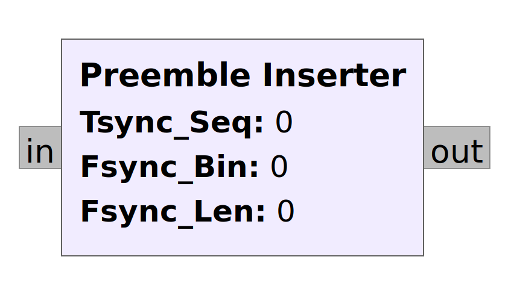

# Preemble Inserter
## Block Description:

The block has one message input and one message output. A preamble sequence will be inserted in front of each incoming message. The preamble firstly consinsts of a Zadoff-Chu Sequence which can be used for fine time correction. The second part is a exponential function, which can be used for coarse frequency correction. Therefore this block only produces a output, if a message is present on the input. 

In order to function properly the following variables need to be defined:

- `Tsync_Seq` specifies the time synchronisation sequence (Zadoff-Chu Sequence) 
- `Fsync_Bin` specifies the number of bins used by the exponential function
- `Fsync_Len` specifies the length of the exponential function

 
 
 

## Used functions:

`message_port_register_out(port_id)`
- Creates a new output message port, with **port_id** as its name 
- Same Usage, if a input port is created: `message_port_register_in(port_id)`
- **port_id** needs to be pmt type, so one needs to convert it 
- If the name should be a string use:
- `message_port_register_out(pmt.intern(<name>))`

 
 

`pmt_string = pmt.intern("<string>")`
- Returns a pmt_string 
- Needs to be used for **port_id** 

 
 

`set_msg_handler(which_port, msg_handler)`
- Defines a function **msg_handler**, which will be called if a message is present on **which_port**

 
 

`py_message = pmt.to_python(message)`
- Returns a dict with the information from **message**
- The actual data can be accessed with:
- `py_message[0]` -> dictionary
- `py_message[1]` -> actual data

 
 

`pdu = pmt.cons(x, y)`
- Returns a **pdu** from **x** and **y**
- `pmt.PMT_NIL` is the **car** (first object)
- The rest is the **cdr** (second object)
- Together it constructs a pair called pdu 
- PDUs are special pairs, which consist of a dictionary and a uniform vector.  
- The dictionary can contain any key/value pairs useful to describe the data 
- Although it can also be empty: `pmt.PMT_NIL`

 
 

`pmt_object = pmt.init_c32vector(size_t, data)`
- Returns a complex 32 pmt vector, from **data**
- **size_t** defines the size of the vector
- The returned object can be used as data for `pmt_cons()`

 
 

`message_port_pub(port_id, msg)`
- Puts **msg** on the specified **port_id**
- Note: both variables need to be of type pmt

